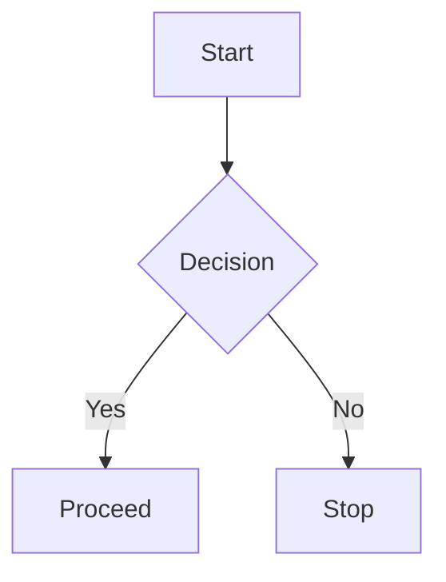

+++
date = "2026-08-08"
title = "Markdown Demo"
author = "Edwaldo Almeida"
description = "A Markdown demonstration"
hideReadingTime = false          # Optional: hide reading time for this page
tags = ["misc"]
categories = ["misc"]
draft = false
+++

# Markdown Demo — Every Possibility

A reference covering all standard Markdown (CommonMark + GFM) capabilities, plus common extensions. Use this file as a cheat sheet — copy the syntax blocks into your own documents.

---

## Headings

# H1 — Heading level 1
## H2 — Heading level 2
### H3 — Heading level 3
#### H4 — Heading level 4
##### H5 — Heading level 5
###### H6 — Heading level 6

Also valid: underline-style headings (setext).

H1 with `===`
===

H2 with `---`
---

## Paragraphs & Line Breaks

A paragraph is just one or more consecutive lines of text separated by blank lines.

To force a line break without starting a new paragraph,  
end a line with two trailing spaces and press enter.

Single returns do **not** break the line — this text is still
part of the same paragraph.

---

## Emphasis & Styling

| Syntax            | Renders           |
|-------------------|-------------------|
| `*italic*`        | *italic*          |
| `_italic_`        | _italic_          |
| `**bold**`        | **bold**          |
| `__bold__`        | __bold__          |
| `***bold italic***`| ***bold italic*** |
| `**bold and *nested* italic**` | **bold and *nested* italic** |
| `~~strikethrough~~` | ~~strikethrough~~ |
| `==highlight==`   | ==highlight== (GFM extension) |

---

## Code

### Inline code

Use backticks for `inline code` with `variable = 42` preserved literally.

### Fenced code block

```python
# Python example
def greet(name: str) -> str:
    """Return a greeting."""
    return f"Hello, {name}!"

if __name__ == "__main__":
    print(greet("World"))
```

### Code block with no language

```
Raw code block — no syntax highlighting applied.
```

### Indented code block (4 spaces)

    A line of indented code
    Another line

### Escaping backticks inside code

Use double backticks when the code itself contains a single tick: `` code with `tick` inside ``

---

## Blockquotes

> This is a blockquote.
> It can span multiple lines.
>
> Blockquotes can **contain other elements**:
>
> - Lists
> - Code
> - Nested quotes

### Nested blockquote

> Level one
>
> > Level two
> >
> > > Level three

---

## Lists

### Unordered list

- Item one
- Item two
- Item three
  - Nested item A
  - Nested item B
    - Deeper nesting
- Back to root

* Unordered with `*`
+ Unordered with `+`

### Ordered list

1. First item
2. Second item
3. Third item

### Ordered list with offset start

4. Starts at four
5. Continues to five

### Nested mixed list

1. First
2. Second
   - Bullet nested in ordered
   - Another bullet
3. Third
   1. Ordered nested
   2. Where it makes sense

### Task list (GFM)

- [x] Completed task
- [ ] Incomplete task
- [ ] Another todo

---

## Links

### Inline link

The [Hermes docs](https://hermes-agent.nousresearch.com/docs) are authoritative.

### Link with title

[GitHub](https://github.com "Visit GitHub")

### Reference-style link

The [agent docs][docs] explain everything.

[docs]: https://hermes-agent.nousresearch.com/docs

### Bare URL (auto-linked in GFM)

https://example.com

### Email auto-link

<mailto:somebody@example.com>

---

## Images


Inline image with size hint (GFM): 

---

## Horizontal Rules

Three ways to make a thematic break:

---

***

___

---

## Tables (GFM)

### Basic table

| Name  | Role       | Page |
|-------|------------|------|
| Herbie| Assistant  | 1    |
| Eddie | Operator   | 2    |

### Table with alignment

| Left-aligned | Centered    | Right-aligned |
|:-------------|:-----------:|--------------:|
| left         | centered    | right         |
| a            | b           | c             |

---

## Footnotes

Here is a sentence with a footnote.[^1]

Another reference to the same note.[^1]

[^1]: This is the footnote text — might not render on all platforms (CommonMark extension).

---

## Escaping Special Characters

Escape to show literal characters:

\*not italic\* · \# not a heading · \` not code \` · \> not a quote · \[ not a link \]

Alternatively wrap things in backticks: `*raw literal*`

---

## HTML (pass-through)

Markdown allows inline HTML that renderers pass through:

<span style="color:red">Red text via HTML</span>

<div align="center">Centered div content</div>

<p>This is a <strong>paragraph</strong> written in HTML.</p>

<br/>

---

## Definition Lists (extension)

Term
: Definition of the term.

Another term
: First definition.
: Second definition.

---

## Abbreviations (extension)

The HTML specification is maintained by *[HTML]*.

*[HTML]: HyperText Markup Language

---

## Strikethrough & Superscript/Subscript (extensions)

~~deleted text~~ — GFM

H~2~O — subscript (often needs extension)

E=mc^2^ — superscript (often needs extension)

---

## Math (extension)

Inline math: $\sqrt{a^2 + b^2}$

Block math:

$$
f(x) = \int_{-\infty}^{\infty} \hat{f}(\xi)\,e^{2\pi i \xi x}\,d\xi
$$

---

## Admonitions / Callouts (extension, e.g. GitHub alerts)

> [!NOTE]
> Useful information that users should know.

> [!TIP]
> Helpful advice for doing things better.

> [!IMPORTANT]
> Key information users need to know.

> [!WARNING]
> Urgent info that needs immediate attention.

> [!CAUTION]
> Advises about certain risks.

---

## Mermaid Diagram (GitHub extension)



---

## Details / Collapsible sections (GitHub)

<details>
<summary>Click to expand</summary>

This content is hidden until expanded.

- Bullet one
- Bullet two

</details>

---

## Emoji (GFM shortcodes)

:tada: :rocket: :sparkles: :white_check_mark: :warning:

---

## Keyboard keys (GitHub)

Press <kbd>⌘</kbd> + <kbd>Shift</kbd> + <kbd>P</kbd> to open the command palette.

---

## Markdown link / front matter

YAML-style front matter (used by Jekyll, skills, etc.):

```yaml
---
title: "Markdown Demo"
date: 2026-08-07
tags: [reference, markdown]
---
```

---

*End of reference — everything above demos the widest common subset of Markdown across GitHub, VS Code, and most renderers. Not every extension renders in every tool; the core CommonMark block (headings → horizontal rules) is universal.*